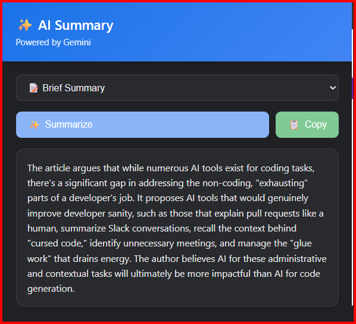
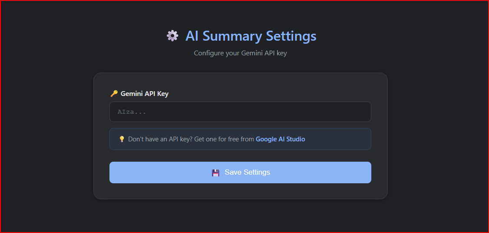

# AI Summary for Articles

A Chrome extension that uses Google's Gemini AI to summarize web articles instantly.

## Features

- Multiple summary types: brief, detailed, or bullet-point format
- One-click summarization of any webpage content
- Copy summaries to clipboard
- Powered by Gemini 2.5 Flash model

## Installation

1. Clone or download this repository
2. Open Chrome and navigate to `chrome://extensions/`
3. Enable "Developer mode"
4. Click "Load unpacked" and select the extension directory
5. Get a free API key from [Google AI Studio](https://aistudio.google.com/app/apikey)
6. Configure your API key in the extension settings

## Usage

1. Navigate to any article or webpage
2. Click the extension icon
3. Select your preferred summary type
4. Click "Summarize"
5. Copy the generated summary if needed

## Screenshots

## Requirements

- Chrome browser with Manifest V3 support
- Gemini API key from Google AI Studio

## Permissions

- `activeTab`: Read content from the current webpage
- `storage`: Store API key securely
- `scripting`: Extract article text from pages

## License

MIT License
